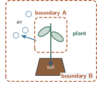
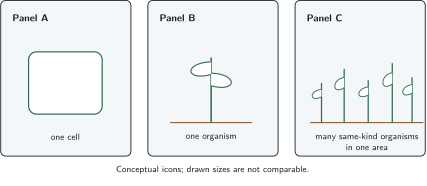

+++
order = 1
subject = "biology"
tags = ["biology", "scientific-inquiry", "systems-thinking", "scale"]
prerequisites = []
provides = [
  "biology",
  "organism",
  "living-system",
  "system-boundary",
  "biological-scale",
  "cell",
  "population",
  "variation",
  "mechanistic-explanation",
  "evidence",
  "model",
]
+++

# Living systems, boundaries, and scale

<!-- card-id: 1caf28c2-97a7-4751-b85d-c2f6a8e449a5 -->
Q: Biology is the study of life. An **organism** is one individual living thing; a dog, a houseplant, and one mushroom are examples. In this context, what does *organism* mean?
A: **One individual living thing.**

<!-- card-id: c2592739-d645-4ff9-abb4-6bdac2aae321 -->
Q: What does biology study?
A: **Life and living systems.** Biology asks how living things work, interact, and change.

<!-- card-id: 288866f0-34b8-4576-814b-d711b789ac86 -->
Q: In systems reasoning, a **system** is a chosen set of parts, called **components**, and the ways those parts affect one another, called **interactions**. If dry soil changes a plant's condition, what kind of relationship connects the soil and plant?
A: **An interaction.** One component—the soil—affects another component—the plant.

<!-- card-id: 8e542a02-4865-489b-a824-2d8f7d26b097 -->
Q: A **system boundary** separates what a study includes from what it treats as outside. What decision does the boundary record?
A: **Which parts and interactions are inside the system being studied, and which are outside.**

<!-- card-id: 4b0a6a0b-5761-4a0b-9464-2a87317e6e29 -->
Q: What makes a collection of things a useful system for a biological question?
A: **It identifies relevant components, their interactions, and a boundary.** The useful choices depend on the question.

<!-- card-id: 4b4c8bb3-0526-4b8f-b541-57b2330e664b -->
Q: In this diagram, each dashed outline is a candidate system boundary, and arrows show possible effects between components.

A plant **wilts**—loses firmness and droops—during hot, dry conditions. Which candidate boundary is more useful for asking how soil and nearby air contribute, and why?
A: **Candidate B.** It includes the plant, soil, nearby air, and their possible interactions; Candidate A treats soil and air as outside.

<!-- card-id: 6c0dd58a-2a2f-4e08-9fce-dc44818b52c3 -->
P: A researcher defines a system as a plant alone but asks how dry soil and nearby air affect that plant. How should the system boundary be revised?
S: **IDENTIFY:** The boundary excludes two components named in the question.

**PLAN:** Include every component whose interaction the question asks about.

**EXECUTE:** Expand the boundary to include the plant, soil, and nearby air.

**EVALUATE:** The revised system now contains every named possible contributor and the interactions among them. Including them makes the question representable; it does not establish that either one caused the change.

<!-- card-id: 57636c0b-c611-4585-b7c7-78e3039fe10f -->
Q: Biologists choose a **scale**: the size or level at which they ask a question. A **cell** is the smallest basic unit of life; an **organism** is one individual living thing; a **population** is a group of organisms of the same kind in the same area. A question about the height of one whole tree is at which scale?
A: **The organism scale.** The question concerns one individual living thing.

<!-- card-id: dfdf9acb-6447-4404-947d-746d8e747bec -->
Q: What is the decisive difference between an organism-scale question and a population-scale question?
A: **An organism-scale question concerns one individual; a population-scale question concerns a group of the same kind in one area.**

<!-- card-id: 4a2d9e2a-c4aa-4b07-9a25-bcae3a09dff3 -->
Q: The panels show three possible scales. The icons are conceptual; their drawn sizes are not meant to be compared.

To investigate why the number of one kind of plant in a field changed over five summers, which panel is the best starting scale?
A: **Panel C, the population scale.** The question concerns a group's number in one area over time.

<!-- card-id: 0a59ee3a-396f-442f-8071-62227368b878 -->
Q: A young plant becomes taller. One explanation describes the whole plant's change in height; another describes its cells becoming more numerous and some becoming larger. How can these explanations relate if both accurately describe what happens?
A: **They can be complementary explanations at different scales.** Changes among cells can contribute to a change observed in the whole organism.

<!-- card-id: 72b482da-be8f-4a33-8681-d97d51a970b7 -->
Q: In biology, **variation** means differences among organisms in a population. Three young plants of the same kind differ in height. Why is one plant a risky stand-in for the whole population?
A: **It may not represent the population's variation.** One individual shows one outcome, not the full range among individuals.

<!-- card-id: 9bacbae3-f03c-4a8e-a2ea-22991c1d8707 -->
Q: Someone watches one snail move slowly for one minute and concludes, “All snails always move at that speed.” What is the main flaw in this reasoning?
A: **It generalizes from one organism and one brief viewing while ignoring variation.**

<!-- card-id: 34735e77-5c36-4e0b-bbfb-5a76aa257cdf -->
Q: A **mechanism** is a process that produces an outcome. “The stem bends because it needs light” names a need but not a process. What question would instead ask for a mechanism?
A: **“What process causes the stem to bend toward the light?”**

<!-- card-id: de7bc10e-2a38-4a90-a9c8-9e573975a263 -->
Q: A young plant stem bends toward light from one side. Which is the mechanistic explanation, and what makes it mechanistic?

1. The stem bends because it needs light.
2. The two sides lengthen by different amounts, so the stem curves.

A: **Explanation 2.** It describes a process that produces bending; “needs light” describes a possible benefit without supplying the steps that produce bending.

<!-- card-id: 3e2e962c-eb2f-41be-8f97-d66667670f12 -->
Q: An **observation** is something recorded, a **claim** is a statement about what is happening, and **evidence** is an observation used to judge a claim. A person records that a plant's leaves drooped after its soil dried, then says dry soil caused the drooping. Which part is the observation?
A: **The recorded drooping after the soil dried.** “Dry soil caused it” is the claim being judged.

<!-- card-id: f68939a7-0271-43ef-a90f-7d534e01f076 -->
Q: Evidence from one plant shows that its leaves drooped after its soil dried. How strongly does that support the claim that dry soil was the only possible cause?
A: **It is consistent with dry soil contributing, but it does not establish that dry soil was the only cause.** One sequence does not rule out other explanations.

<!-- card-id: cd5fd20b-b91f-4954-8fb8-ab20c9677dd9 -->
Q: A **model** is a purposeful simplification used to represent or reason about something. Details it leaves out are limitations, not automatically errors. Why can the boundary diagram still be useful even though it omits exact shapes and timing?
A: **Those details are not needed for its purpose: comparing which components and interactions each boundary includes.** A model's omissions matter when they interfere with the question it is used to answer.

<!-- card-id: a708434b-757d-4029-932d-a78aaa263b77 -->
Q: Two models address why a plant wilted in a hot, dry setting. Model X shows detailed leaf shapes but excludes soil and air. Model Y uses a plain plant symbol but includes interactions with soil and nearby air. Which model is more useful for this question, and why?
A: **Model Y.** It represents the relationships relevant to the question; visual detail alone does not compensate for omitting possible contributors. It guides what to investigate rather than proving a cause.
