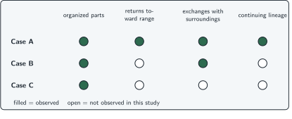
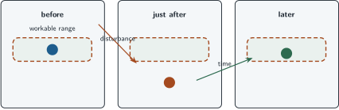

+++
order = 2
subject = "biology"
tags = ["biology", "living-systems", "patterns", "scientific-inquiry"]
prerequisites = ["chapter:01_living_systems_and_scale"]
provides = [
  "life-process-criteria",
  "biological-organization",
  "regulation",
  "lineage",
  "boundary-case",
]
+++

# Patterns of life and the limits of definitions

<!-- card-id: 20000000-0000-4000-8000-000000000001 -->
Q: Biologists often recognize life from a **cluster of processes**: organized parts interact, conditions are regulated, matter and energy enter and leave, surroundings are detected and answered, and living things can produce new living things. Why use a cluster instead of one visible feature?
A: **No single visible feature separates every living case from every nonliving one.** Several linked processes provide stronger evidence, and difficult cases require stated criteria.

<!-- card-id: 20000000-0000-4000-8000-000000000002 -->
Q: A mushroom does not move from place to place, but it has organized living parts, takes in material, changes as it grows, and belongs to a reproducing lineage. Why is lack of movement not enough to classify it as nonliving?
A: **Movement from place to place is not a required life criterion.** The mushroom shows a broader cluster of living processes.

<!-- card-id: 20000000-0000-4000-8000-000000000003 -->
Q: In a living system, **organization** means that interacting parts are arranged so their combined activity supports the system. What makes this more informative than merely saying that many parts are present?
A: **Organization includes arrangement and interaction, not just a collection.** The relationships among parts help produce what the system does.

<!-- card-id: 20000000-0000-4000-8000-000000000004 -->
Q: A clock has organized interacting parts. Why does that observation alone not establish that the clock is alive?
A: **Organization is only one criterion.** The clock must be judged against the broader cluster of living processes rather than classified from one shared feature.

<!-- card-id: 20000000-0000-4000-8000-000000000005 -->
Q: **Regulation** is a system's action that keeps a condition within a workable range or returns it toward that range after change. If a plant closes small leaf openings during dry conditions and thereby slows water loss, what role does the closing play?
A: **Regulation.** The response counteracts water loss and helps keep the plant's condition within a workable range.

<!-- card-id: 20000000-0000-4000-8000-000000000006 -->
Q: Regulation does not mean “never changes.” After a disturbance, what pattern would instead support a claim of regulation?
A: **The condition changes and is then opposed or moved back toward a workable range.** Regulation limits or corrects change; it need not hold a perfectly fixed value.

<!-- card-id: 20000000-0000-4000-8000-000000000007 -->
Q: A **lineage** is a continuing sequence of organisms connected through reproduction. Why can a living individual that cannot reproduce still belong to life?
A: **Reproduction is a property of the continuing lineage, not a requirement that every individual reproduce.** Other living processes can occur in that individual.

<!-- card-id: 20000000-0000-4000-8000-000000000008 -->
Q: What is the decisive difference between an individual organism and a lineage?
A: **An organism is one living individual; a lineage is continuity across reproducing generations.**

<!-- card-id: 20000000-0000-4000-8000-000000000009 -->
Q: A **boundary case** is difficult to classify because it satisfies some proposed criteria but not others. What should a careful biological classification state about such a case?
A: **The criteria and system boundary being used, plus which criteria the case satisfies or fails.** A label without those choices hides the source of disagreement.

<!-- card-id: 20000000-0000-4000-8000-000000000010 -->
Q: The matrix summarizes observations; a filled circle means the process was observed, and an open circle means it was not observed in this study.

Which case has the strongest observed cluster of living processes?
A: **Case A.** It has observed evidence in all four categories; this comparison supports a classification but does not create an exceptionless definition of life.

<!-- card-id: 20000000-0000-4000-8000-000000000011 -->
Q: A checklist says every living individual must be actively growing and reproducing at the moment of observation. What is the flaw in using it as an exceptionless definition?
A: **Living processes can be inactive at one moment, and reproduction can belong to a lineage rather than every individual.** The checklist confuses current observation with the system's broader capacities and history.

<!-- card-id: 20000000-0000-4000-8000-000000000012 -->
Q: The panels track one internal condition. The dashed band is its workable range; the arrow marks a disturbance.

What feature of the sequence is evidence for regulation rather than simple unopposed change?
A: **After displacement, the condition moves back toward the workable range.** The return pattern is consistent with a response that counteracts the disturbance.

<!-- card-id: 20000000-0000-4000-8000-000000000013 -->
P: A solar-powered machine has organized parts, takes in energy, and changes its fan speed when it gets hot. No cells or continuing lineage are observed. Should these observations alone classify it as living?
S: **IDENTIFY:** This is a classification from a partial criteria cluster.

**PLAN:** Compare the observations with multiple living processes and note missing evidence.

**EXECUTE:** Do not classify it as living from these observations alone. Organization, energy input, and response are shared with some nonliving systems; evidence for cellular living organization and lineage continuity is absent.

**EVALUATE:** The conclusion is bounded: the observations are insufficient, not proof that no additional evidence could ever change the classification.

<!-- card-id: 20000000-0000-4000-8000-000000000014 -->
Q: A dry seed is **dormant**—its activity is greatly reduced. No growth or response is observed during one hour, but after water is added it grows into a plant. Why can a one-hour checklist misclassify it?
A: **The observation period is too narrow for the criteria being judged.** Classification should state the timespan and distinguish a process not observed now from a capacity shown under other conditions.
