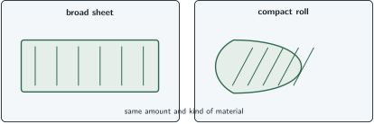
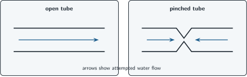

+++
order = 3
subject = "biology"
tags = ["biology", "structure-function", "constraint", "mechanism"]
prerequisites = ["chapter:02_patterns_of_life"]
provides = [
  "structure-function",
  "biological-constraint",
  "tradeoff",
  "current-function",
]
+++

# Structure, function, and constraint

<!-- card-id: 30000000-0000-4000-8000-000000000001 -->
Q: A biological **structure** is the arrangement and material of a body or part. Its **function** is a role it performs in a stated system. What relationship does structure–function reasoning investigate?
A: **How a part's arrangement and material enable, limit, or alter what it can do.**

<!-- card-id: 30000000-0000-4000-8000-000000000002 -->
Q: Two plant roots contain the same amount of material. One branches into many thin tips; the other is one unbranched piece. Which structural difference could change how much surrounding soil they contact?
A: **The arrangement into many thin branches.** Branching spreads the material through more of the surrounding soil.

<!-- card-id: 30000000-0000-4000-8000-000000000003 -->
Q: A material's properties—such as stiffness, flexibility, or permeability—can constrain function. In this context, what is a **constraint**?
A: **A feature that limits the possible structures or actions of a biological system.** A constraint narrows what can occur; it does not mean nothing can work.

<!-- card-id: 30000000-0000-4000-8000-000000000004 -->
Q: A thin part must bend repeatedly without breaking. All else equal, which material property is more compatible with that function: flexibility or brittleness?
A: **Flexibility.** Brittleness would constrain repeated bending because the material tends to break rather than deform safely.

<!-- card-id: 30000000-0000-4000-8000-000000000005 -->
Q: Why should a structure–function explanation name both arrangement and material when both matter?
A: **Either can change performance independently.** The same shape made from a different material, or the same material arranged differently, can function differently.

<!-- card-id: 30000000-0000-4000-8000-000000000006 -->
Q: A **tradeoff** occurs when a feature improves one performance while worsening another under the same conditions. Why is “best structure” incomplete without naming a function and conditions?
A: **A structure can be better for one task but worse for another.** Performance must be judged for a specified role and setting.

<!-- card-id: 30000000-0000-4000-8000-000000000007 -->
Q: Light can be intercepted only where it reaches a surface. The two structures use the same amount of material, but one spreads it into a broad sheet and the other into a compact roll.

Which arrangement would intercept light across a wider area, and what visible feature supports the inference?
A: **The broad sheet.** Its material is spread across a wider exposed area instead of being packed into a compact roll.

<!-- card-id: 30000000-0000-4000-8000-000000000008 -->
Q: The compact roll in the comparison exposes less area but has more layers between its center and surroundings. What tradeoff does this suggest relative to the broad sheet?
A: **It sacrifices exposed area while increasing protective layering.** Which arrangement is preferable depends on whether interception or shielding is the relevant function.

<!-- card-id: 30000000-0000-4000-8000-000000000009 -->
Q: A structure's **current function** is what it does now. A claim about its **historical origin** concerns the earlier process by which it arose. Why does showing a current benefit not by itself explain origin?
A: **Present performance does not identify the historical steps or causes that produced the structure.** Function and origin are different claims requiring different evidence.

<!-- card-id: 30000000-0000-4000-8000-000000000010 -->
Q: “This shell exists because the animal needed protection” names a benefit. What would a mechanistic structure–function explanation add without claiming an origin?
A: **It would state how shell features reduce or redirect damaging forces in the present.** That explains current performance, not the earlier process by which the shell arose.

<!-- card-id: 30000000-0000-4000-8000-000000000011 -->
Q: The diagrams show the same hollow tube before and after it is pinched. Arrows indicate attempted water flow.

How does the structural change constrain the tube's transport function?
A: **The pinch narrows or closes the continuous interior path, so less water can pass.** The inference follows from the changed geometry, not from a claim that the tube intended to stop flow.

<!-- card-id: 30000000-0000-4000-8000-000000000012 -->
P: A small animal uses a surface covered with backward-pointing flexible hooks to hold onto fur. Predict what would happen if the hooks were replaced by smooth straight hairs of the same material.
S: **IDENTIFY:** This is a structure-to-function prediction with material held constant.

**PLAN:** Compare how hook shape and straight shape interact with fur.

**EXECUTE:** Holding would likely weaken because straight hairs are less able to catch around fur strands; the changed arrangement removes the catching geometry.

**EVALUATE:** The prediction is conditional, not absolute: it assumes comparable hair number, size, flexibility, and contact conditions.

<!-- card-id: 30000000-0000-4000-8000-000000000013 -->
Q: Two structures perform the same role equally well in one environment but differently in another. What does this show about structure–function claims?
A: **They are conditional on the environment and performance criterion.** Equal function in one setting does not imply equal function everywhere.

<!-- card-id: 30000000-0000-4000-8000-000000000014 -->
Q: Which statement is a bounded structure–function claim rather than an origin story?

1. The broad surface intercepts more light because it exposes more area.
2. The broad surface arose because the organism wanted more light.

A: **Statement 1.** It connects a present structural feature to present performance; Statement 2 assigns intention and does not supply a historical mechanism.
