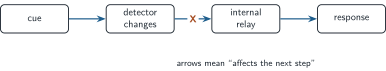
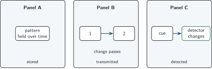

+++
order = 4
subject = "biology"
tags = ["biology", "information", "response", "systems-thinking"]
prerequisites = ["chapter:03_structure_function_and_constraint"]
provides = [
  "biological-information",
  "cue",
  "detector",
  "response-pathway",
  "stored-information",
]
+++

# Information in living systems

<!-- card-id: 40000000-0000-4000-8000-000000000001 -->
Q: In this deck, **biological information** means a difference or pattern that a living system can detect and use to alter what happens next. Why must the system's response be included in this operational meaning?
A: **A difference counts as information for that system only if it can affect the system's possible action or state.** A pattern may exist without being detected or used.

<!-- card-id: 40000000-0000-4000-8000-000000000002 -->
Q: A plant changes its growth direction when light comes mainly from one side. What makes the light-direction difference information for the plant in this example?
A: **The plant detects the difference and its growth changes.** The claim is about the cue's effect, not about conscious interpretation.

<!-- card-id: 40000000-0000-4000-8000-000000000003 -->
Q: A **cue** is a detectable difference; a **detector** is the part that changes when it encounters the cue; a **response** is a later change in the system. What causal path do these terms describe?
A: **Cue → detection → response.** Additional steps can occur between detection and response.

<!-- card-id: 40000000-0000-4000-8000-000000000004 -->
Q: What is the decisive difference between a cue and a response?
A: **The cue is the detected input difference; the response is the system change that follows.**

<!-- card-id: 40000000-0000-4000-8000-000000000005 -->
Q: In the diagram, arrows mean “affects the next step.” A break at X prevents the detector's change from reaching the response.

If the cue and detector still change normally, what is the earliest shown failure caused by the break?
A: **The internal relay does not receive the detector's effect.** The response may then fail even though the cue was detected.

<!-- card-id: 40000000-0000-4000-8000-000000000006 -->
Q: Why does a missing response not by itself prove that no cue was detected?
A: **A later step could be interrupted after detection.** The path must be checked step by step rather than inferred only from its final output.

<!-- card-id: 40000000-0000-4000-8000-000000000007 -->
Q: **Transmission** occurs when a change in one component produces a change in another. How does transmission differ from detection?
A: **Detection converts a cue into a change in the detector; transmission carries an effect from one component to the next.**

<!-- card-id: 40000000-0000-4000-8000-000000000008 -->
Q: **Stored information** is a persistent arrangement or state that can guide a later event. Which role is shown when a state remains after the original cue is gone and changes a later response?
A: **Storage.** Persistence allows an earlier event to influence a later one.

<!-- card-id: 40000000-0000-4000-8000-000000000009 -->
Q: The panels use different shapes as well as labels: a held pattern remains in one component, a moving change passes between components, and a detector changes after a cue.

What visible relationship distinguishes Panel B's transmission from Panel A's storage?
A: **Panel B shows a change passing between components, whereas Panel A shows a pattern remaining in one component over time.**

<!-- card-id: 40000000-0000-4000-8000-000000000010 -->
Q: The same cue produces one response when an organism is active and a different response when it is resting. What does this show about cue–response relations?
A: **Responses can depend on the system's context or current state.** A cue does not guarantee one universal output.

<!-- card-id: 40000000-0000-4000-8000-000000000011 -->
Q: Why is “information” not a claim that an organism consciously understands a message?
A: **Biological information can be an operational causal relation: a detectable pattern changes later events.** Conscious meaning is not required.

<!-- card-id: 40000000-0000-4000-8000-000000000012 -->
P: A small organism normally moves away after a surface begins vibrating. In a test, the vibration occurs and the detector changes, but the next component does not. Locate the supported failure.
S: **IDENTIFY:** This is a broken cue–response pathway.

**PLAN:** Trace the observed steps in order and stop at the first missing change.

**EXECUTE:** Detection occurred, so the supported failure lies in transmission from the detector to the next component.

**EVALUATE:** The evidence locates a path segment; it does not identify the unseen physical cause of the break.

<!-- card-id: 40000000-0000-4000-8000-000000000013 -->
Q: A researcher records only the final response to a cue. What extra comparison would help distinguish failed detection from a later transmission failure?
A: **Measure whether the detector changes when the cue occurs.** Detector change supports detection; no detector change points to the cue–detector step.

<!-- card-id: 40000000-0000-4000-8000-000000000014 -->
Q: A cue–response diagram has arrows but no timing, strength, or physical mechanism. When is that simplified model still useful?
A: **When the question is which components affect which later steps.** It is insufficient for questions about timing, amount, or the physical process of transmission.
