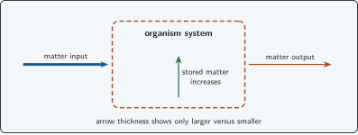
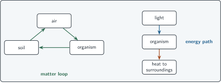

+++
order = 5
subject = "biology"
tags = ["biology", "matter", "energy", "systems-thinking"]
prerequisites = ["chapter:04_information_and_response"]
provides = [
  "matter-energy-tracking",
  "open-system",
  "transfer",
  "transformation",
  "system-budget",
]
+++

# Matter, energy, and living change

<!-- card-id: 50000000-0000-4000-8000-000000000001 -->
Q: **Matter** is physical material that occupies space; **energy** is a quantity transferred or transformed as systems change. Why should a biological explanation track them separately?
A: **Matter and energy answer different accounting questions.** Material can be rearranged and moved, while energy is transferred and changes form; neither should be described as appearing from nothing.

<!-- card-id: 50000000-0000-4000-8000-000000000002 -->
Q: A growing organism gains new body material. What must a matter-tracking explanation identify?
A: **A material input and how some of it became part of the organism.** Growth is not matter appearing without a source.

<!-- card-id: 50000000-0000-4000-8000-000000000003 -->
Q: An **open system** exchanges matter, energy, or both with its surroundings. Why is an organism usefully modeled as open?
A: **It receives inputs and releases outputs across its boundary.** The exact inputs and outputs depend on the organism and question.

<!-- card-id: 50000000-0000-4000-8000-000000000004 -->
Q: What is the decisive difference between an input and an output in a system model?
A: **An input crosses the chosen boundary into the system; an output crosses from the system to the surroundings.**

<!-- card-id: 50000000-0000-4000-8000-000000000005 -->
Q: A **transfer** moves matter or energy between parts or across a boundary. A **transformation** changes its form within the accounting model. Which term fits energy moving from the surroundings into an organism?
A: **Transfer.** It crosses between systems; a transformation would describe a change of form.

<!-- card-id: 50000000-0000-4000-8000-000000000006 -->
Q: **Storage** means matter or energy remains within a system for a time. Why is storage different from an input?
A: **Storage describes what remains inside; input describes a crossing into the system.** An input can add to storage, but the decisions are distinct.

<!-- card-id: 50000000-0000-4000-8000-000000000007 -->
Q: In the diagram, arrow thickness is qualitative: the organism receives a large material input and a small material output while its stored matter increases.

What relationship explains the increasing stored matter?
A: **Matter input exceeds matter output during the shown interval.** The diagram supports only a qualitative comparison, not a numerical amount.

<!-- card-id: 50000000-0000-4000-8000-000000000008 -->
Q: If the material input in the budget stops while output continues, what qualitative change should be predicted for stored matter?
A: **Stored matter should decrease.** Material continues leaving without replacement from the stopped input.

<!-- card-id: 50000000-0000-4000-8000-000000000009 -->
Q: The diagram uses closed arrows for repeated movement of matter and a one-way path for energy entering as light and leaving as heat.

Which visual feature represents cycling rather than one-way transfer?
A: **The matter arrows return to earlier parts of the system to form a loop.** The energy path enters and leaves without closing a loop in the pictured system.

<!-- card-id: 50000000-0000-4000-8000-000000000010 -->
Q: Why is “energy cycles through the system exactly like matter” misleading in the pictured model?
A: **Matter is reused in the shown loop, whereas energy is transferred through and exits in another form.** The two accounts share transfers but not the same path.

<!-- card-id: 50000000-0000-4000-8000-000000000011 -->
Q: An organism releases waste material. Why does this not mean the matter has been destroyed?
A: **The matter crossed the organism's boundary and remains in the surroundings.** A system-level account must follow outputs, not treat them as disappearance.

<!-- card-id: 50000000-0000-4000-8000-000000000012 -->
Q: “Living things create the energy they need” is a tempting shortcut. What is the bounded correction?
A: **Living systems receive energy and transform or transfer it.** They do not create energy from nothing.

<!-- card-id: 50000000-0000-4000-8000-000000000013 -->
P: A small pond model includes organisms and water but treats incoming light and outgoing heat as if they do not exist. The question asks why activity changes between bright and dark periods. How should the model be revised?
S: **IDENTIFY:** The boundary model omits energy transfers relevant to the question.

**PLAN:** Add the inputs and outputs whose changes could distinguish the periods.

**EXECUTE:** Represent light energy entering the pond system and energy eventually leaving to the surroundings, including as heat.

**EVALUATE:** Adding transfers makes the energy question representable; it does not by itself prove the mechanism behind the activity change.

<!-- card-id: 50000000-0000-4000-8000-000000000014 -->
Q: A model tracks matter inputs and outputs but omits every internal transformation. For which question is it still useful: “Does stored matter rise or fall?” or “Through what steps is material changed?”
A: **It can still answer whether stored matter rises or falls.** It cannot explain the omitted internal transformation steps.
