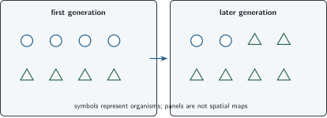
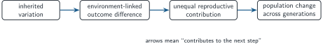

+++
order = 6
subject = "biology"
tags = ["biology", "variation", "inheritance", "evolution"]
prerequisites = ["chapter:05_matter_energy_and_change"]
provides = [
  "inheritance",
  "generation",
  "evolution",
  "natural-selection",
  "nonteleological-evolution",
]
+++

# Variation, inheritance, and evolution

<!-- card-id: 60000000-0000-4000-8000-000000000001 -->
Q: **Variation** means differences among organisms in a population. An **inherited difference** is one that can be passed from parent to offspring. Why does evolution require attention to inherited rather than merely temporary differences?
A: **Only differences that continue across generations can contribute directly to lasting population change.** A temporary individual change ends with that individual unless it affects descendants through some inheritable route.

<!-- card-id: 60000000-0000-4000-8000-000000000002 -->
Q: One plant becomes shorter after its top is cut off. Why is the resulting height difference not automatically evidence of an inherited difference?
A: **The change was produced during that individual's life, and no evidence shows offspring inherit it.** Observing a difference does not establish inheritance.

<!-- card-id: 60000000-0000-4000-8000-000000000003 -->
Q: A **generation** is a parent-to-offspring step in a lineage. In this deck, **evolution** is change in inherited characteristics of a population across generations. At what biological scale does this definition place evolution?
A: **The population scale across generations.**

<!-- card-id: 60000000-0000-4000-8000-000000000004 -->
Q: Why does an individual becoming stronger during life not by itself count as evolution under the deck's definition?
A: **Evolution is population change in inherited characteristics across generations.** An individual's lifetime change is at the wrong scale and timespan unless it contributes to inherited population change.

<!-- card-id: 60000000-0000-4000-8000-000000000005 -->
Q: **Reproductive outcome** means how much an organism contributes offspring to later generations. Why does survival matter evolutionarily only through its connection to reproduction?
A: **Survival alone does not pass inherited differences forward.** It matters when it changes contribution to later generations.

<!-- card-id: 60000000-0000-4000-8000-000000000006 -->
Q: Two inherited variants survive equally well, but one leaves more offspring. Can their proportions change across generations through unequal reproductive outcome?
A: **Yes.** The variant contributing more offspring can become more common even without a survival difference.

<!-- card-id: 60000000-0000-4000-8000-000000000007 -->
Q: **Natural selection** occurs when inherited differences are associated with unequal reproductive outcomes in a particular environment. What three relationships must a selection explanation establish?
A: **Variation is inherited, the variants differ in reproductive outcome, and the difference is connected to the environment.**

<!-- card-id: 60000000-0000-4000-8000-000000000008 -->
Q: Shape is inherited in this simplified population. Circles and triangles begin equally common; triangles leave more offspring in the shown environment.

What population-level change does the later snapshot show?
A: **The triangle variant became more common relative to the circle variant.** The snapshots show a shift in variant proportions, not an individual changing shape.

<!-- card-id: 60000000-0000-4000-8000-000000000009 -->
Q: If the environment changes so circles instead leave more offspring, what qualitative population change should selection predict across later generations?
A: **Circles should tend to become more common, provided shape remains inherited and the reproductive difference persists.**

<!-- card-id: 60000000-0000-4000-8000-000000000010 -->
Q: The diagram presents a simplified selection mechanism; arrows mean “contributes to the next step.”

Which link prevents the explanation from becoming a story about organisms changing because they need to?
A: **Unequal reproductive contribution from already existing inherited variants.** The environment filters variation; it does not create a needed change on demand in each individual.

<!-- card-id: 60000000-0000-4000-8000-000000000011 -->
Q: “The population developed thicker covering because winters became cold and it needed warmth.” What causal step is missing from this statement?
A: **How inherited variation in covering affected reproductive outcomes across generations.** Need language does not supply the population mechanism.

<!-- card-id: 60000000-0000-4000-8000-000000000012 -->
Q: Why is a trait not universally “better” just because selection favors it in one setting?
A: **Reproductive effects depend on the environment and tradeoffs.** A variant favored under one condition may be neutral or harmful under another.

<!-- card-id: 60000000-0000-4000-8000-000000000013 -->
P: In a population of insects, stripe pattern is inherited. On striped bark, birds more often catch insects with a plain pattern, and striped insects leave more offspring. Predict the direction of change if these conditions persist.
S: **IDENTIFY:** This is a natural-selection prediction from inherited variation and unequal reproduction.

**PLAN:** Track which variant contributes more offspring to later generations.

**EXECUTE:** The striped pattern should tend to become more common across generations.

**EVALUATE:** The prediction is conditional on inheritance, the bark and bird interaction, and the reproductive difference continuing; it does not say every insect changes.

<!-- card-id: 60000000-0000-4000-8000-000000000014 -->
Q: A population changes across generations, but researchers have not shown any variant had a reproductive advantage. What is the bounded conclusion about natural selection?
A: **Evolutionary change occurred, but natural selection has not yet been established as its cause.** Population change can be described before its mechanism is known.
