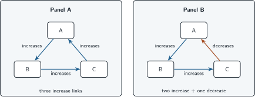
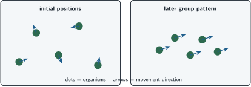

+++
order = 7
subject = "biology"
tags = ["biology", "interactions", "feedback", "emergence"]
prerequisites = ["chapter:06_variation_inheritance_and_evolution"]
provides = [
  "direct-indirect-interaction",
  "reinforcing-feedback",
  "counteracting-feedback",
  "subsystem",
  "emergence",
]
+++

# Interactions, feedback, and emergence

<!-- card-id: 70000000-0000-4000-8000-000000000001 -->
Q: A **direct effect** connects one component to another without an intermediate component in the model. An **indirect effect** passes through one or more intermediates. In the path A → B → C, what kind of modeled effect can A have on C?
A: **An indirect effect through B.**

<!-- card-id: 70000000-0000-4000-8000-000000000002 -->
Q: If A increases B and B decreases C, what qualitative indirect effect should an increase in A have on C, all else equal?
A: **C should decrease.** A raises B, and the raised B suppresses C.

<!-- card-id: 70000000-0000-4000-8000-000000000003 -->
Q: **Feedback** occurs when a change in a system eventually influences the component where the change began. What visual feature distinguishes a feedback model from a one-way chain?
A: **A closed causal loop.** Following the arrows eventually returns to the starting component.

<!-- card-id: 70000000-0000-4000-8000-000000000004 -->
Q: **Reinforcing feedback** amplifies an initial change. If more plants create more shade, shade slows soil drying, and wetter soil supports more plants, what happens to a small initial increase in plants in this simplified loop?
A: **The loop tends to amplify the increase.** More plants promote conditions that support still more plants.

<!-- card-id: 70000000-0000-4000-8000-000000000005 -->
Q: **Counteracting feedback** opposes an initial change. If a population increase reduces available food and reduced food lowers reproduction, how does the loop affect the initial increase?
A: **It tends to oppose or limit the increase.** The consequence feeds back in the opposite direction.

<!-- card-id: 70000000-0000-4000-8000-000000000006 -->
Q: Arrow labels state whether one component increases or decreases the next.

Which panel should oppose a small increase in its starting component, and what visible cue decides?
A: **Panel B.** Its loop contains one decrease link, so the returning effect opposes the starting increase; Panel A's links all reinforce it.

<!-- card-id: 70000000-0000-4000-8000-000000000007 -->
Q: A counteracting loop is weakened by breaking its return link. What qualitative change becomes more likely after a disturbance?
A: **A larger or more persistent departure from the earlier condition.** The system has lost a modeled route that opposed the disturbance.

<!-- card-id: 70000000-0000-4000-8000-000000000008 -->
Q: Why is counteracting feedback not automatically beneficial, and reinforcing feedback not automatically harmful?
A: **The labels describe the direction of change, not its value.** Whether an outcome is beneficial depends on the system, conditions, and criterion being judged.

<!-- card-id: 70000000-0000-4000-8000-000000000009 -->
Q: A **subsystem** is a chosen set of interacting components inside a larger system. Why can studying a subsystem be useful but incomplete?
A: **It isolates relationships relevant to a question but may omit influences crossing its boundary.**

<!-- card-id: 70000000-0000-4000-8000-000000000010 -->
Q: An **emergent pattern** is a system-level pattern produced by interactions among parts even though no single part contains the whole pattern. What makes emergence different from a mysterious extra force?
A: **The pattern is explained by component rules and interactions at another scale.** It is new at the system level, not uncaused.

<!-- card-id: 70000000-0000-4000-8000-000000000011 -->
Q: Each dot represents an organism following two local rules: remain near neighbors and align movement with nearby neighbors.

What system-level pattern emerges in the later panel?
A: **An aligned moving group.** The group pattern arises from repeated local interactions, not from one organism specifying the whole arrangement.

<!-- card-id: 70000000-0000-4000-8000-000000000012 -->
P: In a model, more leaves increase shade, shade increases nearby moisture, and moisture increases leaf growth. A gardener removes half the leaves. Predict the loop's initial tendency if other conditions stay similar.
S: **IDENTIFY:** This is a reinforcing feedback perturbation.

**PLAN:** Trace the decrease around the complete loop.

**EXECUTE:** Fewer leaves mean less shade, then less moisture, then less leaf growth, so the loop tends to reinforce the initial decrease.

**EVALUATE:** This is a direction prediction from the model; omitted inputs could weaken or reverse the real outcome.

<!-- card-id: 70000000-0000-4000-8000-000000000013 -->
Q: A researcher explains a group pattern only by describing one isolated organism. What important possibility does this miss?
A: **Interactions among organisms may generate an emergent group-level pattern.** Isolated behavior need not reveal the behavior of the interacting system.

<!-- card-id: 70000000-0000-4000-8000-000000000014 -->
Q: A feedback diagram shows arrow directions but no delay or strength. What can it support, and what can it not support?
A: **It can support qualitative effect tracing.** It cannot establish how fast or how strongly the system changes.
