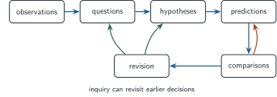
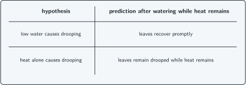

+++
order = 8
subject = "biology"
tags = ["biology", "scientific-inquiry", "hypotheses", "predictions"]
prerequisites = ["chapter:07_interactions_feedback_and_emergence"]
provides = [
  "bounded-question",
  "descriptive-explanatory-question",
  "hypothesis",
  "prediction",
  "disconfirming-result",
]
+++

# Questions, claims, and testable predictions

<!-- card-id: 80000000-0000-4000-8000-000000000001 -->
Q: A **bounded question** names the system, outcome, conditions, and scope needed for a clear investigation. Why is “How do plants work?” not bounded?
A: **It leaves the system, outcome, conditions, and scope open.** Many different investigations could answer different parts of it.

<!-- card-id: 80000000-0000-4000-8000-000000000002 -->
Q: Improve “Does light affect plants?” into a bounded question about young plants, stem bending, and light from one side over one day.
A: **For young plants observed for one day, how does light from one side affect the direction of stem bending?**

<!-- card-id: 80000000-0000-4000-8000-000000000003 -->
Q: A **descriptive question** asks what pattern occurs; an **explanatory question** asks what process produces it. Which kind is “At what time of day do these flowers open?”
A: **Descriptive.** It asks when a pattern occurs, not what produces the opening.

<!-- card-id: 80000000-0000-4000-8000-000000000004 -->
Q: Turn the descriptive observation “flowers open near sunrise” into an explanatory question without assuming a cause.
A: **What process causes these flowers to open near sunrise?**

<!-- card-id: 80000000-0000-4000-8000-000000000005 -->
Q: A **hypothesis** is a bounded proposed explanation that can be evaluated with evidence. What makes “morning light triggers opening” a hypothesis rather than an observation?
A: **It proposes a causal explanation beyond the recorded pattern.** The observation is that opening occurred near sunrise.

<!-- card-id: 80000000-0000-4000-8000-000000000006 -->
Q: A **prediction** states an expected observation if a hypothesis and stated conditions hold. If morning light triggers flower opening, what prediction follows for flowers kept dark through sunrise?
A: **They should not open at the usual sunrise time, or opening should be delayed, under otherwise relevant conditions.**

<!-- card-id: 80000000-0000-4000-8000-000000000007 -->
Q: What is the decisive difference between a hypothesis and a prediction?
A: **A hypothesis proposes an explanation; a prediction states an expected observable consequence if that explanation holds.**

<!-- card-id: 80000000-0000-4000-8000-000000000008 -->
Q: Arrows in the map show possible moves in inquiry, including returns to earlier steps.

What feature shows that inquiry is iterative rather than a fixed one-way sequence?
A: **Several arrows return from comparison or revision to questions, hypotheses, and predictions.** Results can change earlier decisions.

<!-- card-id: 80000000-0000-4000-8000-000000000009 -->
Q: Why can an investigation begin with a descriptive question instead of a hypothesis?
A: **A pattern may need to be established before a plausible explanation can be proposed.** Inquiry has multiple valid entry points.

<!-- card-id: 80000000-0000-4000-8000-000000000010 -->
Q: A **result against a hypothesis** is an observation that conflicts with a prediction derived from it under the stated conditions. Why is such a result especially informative?
A: **It shows that the explanation, an assumption, or the test conditions need revision.** It narrows what remains plausible.

<!-- card-id: 80000000-0000-4000-8000-000000000011 -->
Q: Two hypotheses explain leaf drooping. The table lists their distinct predictions after water is restored while heat remains high.

If leaves recover promptly after watering while heat remains high, which hypothesis is more directly supported by this comparison?
A: **The low-water hypothesis.** Its distinct prediction occurred; the heat-only prediction did not.

<!-- card-id: 80000000-0000-4000-8000-000000000012 -->
Q: A prediction says “something may change somehow.” What defect prevents it from strongly evaluating a hypothesis?
A: **It does not identify a specific observable outcome.** Nearly any result could be treated as compatible.

<!-- card-id: 80000000-0000-4000-8000-000000000013 -->
P: Observation: five snails moved under a board after the ground became bright. Hypothesis: brightness, rather than elapsed time alone, changes where the snails move. Write one discriminating prediction.
S: **IDENTIFY:** Derive an observable consequence that separates the brightness explanation from the time-only alternative.

**PLAN:** Vary whether brightness changes while considering the same observation period.

**EXECUTE:** If brightness drives the movement, snails exposed to increased brightness should move under cover more often or sooner than snails observed for the same period without the brightness increase.

**EVALUATE:** The prediction names an outcome and an alternative; Chapter 9 will refine the comparison needed for causal inference.

<!-- card-id: 80000000-0000-4000-8000-000000000014 -->
Q: One result matches a hypothesis's prediction. Why should a careful claim remain bounded?
A: **Other explanations may predict the same result, and the comparison may have limitations.** Matching evidence supports a hypothesis without making it certain.
