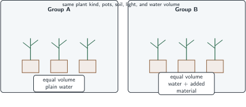
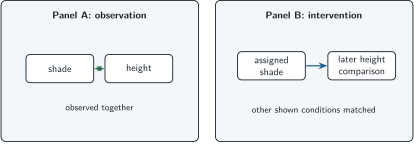

+++
order = 9
subject = "biology"
tags = ["biology", "controls", "causal-inference", "experimental-design"]
prerequisites = ["chapter:08_questions_claims_and_predictions"]
provides = [
  "comparison-group",
  "control",
  "confounding-difference",
  "association",
  "intervention-evidence",
]
+++

# Comparisons, controls, and causal inference

<!-- card-id: 90000000-0000-4000-8000-000000000001 -->
Q: The **focal changed factor** is the condition an investigator wants to test. A **comparison group** provides the outcome expected without that factor, under conditions made as similar as practical. Why is observing only the changed group weak evidence?
A: **There is no reference for what would have happened without the change.** Time, handling, or other conditions could explain the outcome.

<!-- card-id: 90000000-0000-4000-8000-000000000002 -->
Q: The **changed factor** is what an investigator deliberately varies; the **outcome** is what is observed afterward. In a study that varies daily light and records stem bending, which is the outcome?
A: **Stem bending.** Daily light is the changed factor.

<!-- card-id: 90000000-0000-4000-8000-000000000003 -->
Q: A **control** is a designed comparison or condition that helps reveal whether something besides the focal factor could produce the result. What should a basic control preserve?
A: **The relevant handling and conditions except for the focal changed factor.**

<!-- card-id: 90000000-0000-4000-8000-000000000004 -->
Q: Both groups contain the same kind of young plant, pot, soil, light, and water volume. Only Group B's water contains added material.

Which group provides the basic comparison for the effect of the added material?
A: **Group A.** It receives the same water and handling without the added material.

<!-- card-id: 90000000-0000-4000-8000-000000000005 -->
Q: A **confounding difference** is another group difference that could affect the outcome and compete with the focal explanation. If Group B also receives twice as much water, why is the result confounded?
A: **Added material and water amount change together.** Either difference could contribute to the outcome.

<!-- card-id: 90000000-0000-4000-8000-000000000006 -->
Q: What repair isolates the added material from the water-volume confound?
A: **Give both groups the same water volume while varying only whether the added material is present.**

<!-- card-id: 90000000-0000-4000-8000-000000000007 -->
Q: Why are **repeated observations** across several organisms stronger than a single observation for judging whether a group pattern is consistent?
A: **They reveal whether the pattern recurs despite individual variation.** Repetition does not automatically remove a shared confound.

<!-- card-id: 90000000-0000-4000-8000-000000000008 -->
Q: An **association** means two observed features vary together. Why does association alone not establish that one causes the other?
A: **Direction may be reversed, or a third difference may affect both.** Co-occurrence does not isolate an intervention's effect.

<!-- card-id: 90000000-0000-4000-8000-000000000009 -->
Q: **Intervention evidence** comes from deliberately changing a factor and comparing outcomes under otherwise relevant conditions. What causal advantage does intervention provide over observing an association?
A: **It establishes which factor was changed first and can isolate its contribution through comparison.** Its strength still depends on design and scope.

<!-- card-id: 90000000-0000-4000-8000-000000000010 -->
Q: Panel A observes that shaded plants and taller plants occur together. Panel B deliberately changes shade while matching other shown conditions.

Which panel provides the more direct test of whether shade changes height, and why?
A: **Panel B.** Shade is deliberately changed before the outcome comparison, reducing ambiguity about direction and some alternative differences.

<!-- card-id: 90000000-0000-4000-8000-000000000011 -->
Q: A well-matched intervention changes one factor and produces a consistent outcome difference. What bounded causal claim is justified?
A: **Under the studied conditions, changing that factor contributed to the outcome difference.** The result need not generalize to every organism or setting.

<!-- card-id: 90000000-0000-4000-8000-000000000012 -->
P: A researcher tests whether touch causes leaves of a plant to fold. Touched plants are observed at noon outdoors; untouched plants are observed indoors at night. Redesign the comparison.
S: **IDENTIFY:** Touch is confounded with place, time, and surrounding conditions.

**PLAN:** Make groups comparable and vary touch alone.

**EXECUTE:** Observe similar plants in the same place and time; handle both similarly, but apply the defined touch only to one group, then compare folding.

**EVALUATE:** The redesign isolates touch more clearly. Repeating it across plants checks consistency but does not prove universal response.

<!-- card-id: 90000000-0000-4000-8000-000000000013 -->
Q: Both groups are watered from different containers, and only the changed group uses a newly cleaned container. What control issue should be checked?
A: **Container condition is an additional difference.** Use equivalently prepared containers so cleaning does not compete with the focal explanation.

<!-- card-id: 90000000-0000-4000-8000-000000000014 -->
Q: Why can an ethically or practically impossible intervention leave causal uncertainty even after careful observation?
A: **Without changing the factor, competing explanations may remain harder to separate.** Careful observational comparisons can narrow them but require more assumptions.
