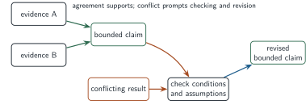
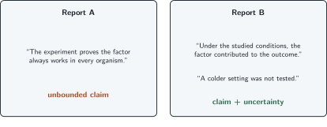
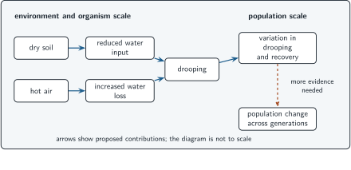

+++
order = 10
subject = "biology"
tags = ["biology", "evidence", "models", "uncertainty", "synthesis"]
prerequisites = ["chapter:09_comparisons_controls_and_causes"]
provides = [
  "converging-evidence",
  "conflicting-evidence",
  "uncertainty",
  "claim-revision",
  "cross-scale-synthesis",
]
+++

# Evidence, models, uncertainty, and synthesis

<!-- card-id: a0000000-0000-4000-8000-000000000001 -->
Q: **Converging evidence** comes from different observations or comparisons that independently support the same bounded claim. Why is convergence stronger than repeating one method alone?
A: **Different methods may have different limitations, so agreement is less likely to depend on one method's weakness.** Independence must be judged, not assumed.

<!-- card-id: a0000000-0000-4000-8000-000000000002 -->
Q: Two studies use different organisms and methods but both support the same mechanism under related conditions. What should be checked before calling their evidence convergent?
A: **Whether the methods truly have distinct limitations and whether the conditions are similar enough for the same claim.**

<!-- card-id: a0000000-0000-4000-8000-000000000003 -->
Q: **Conflicting evidence** occurs when credible results support incompatible expectations. What is the productive response to conflict?
A: **Inspect methods, conditions, assumptions, and claim scope, then revise or distinguish the explanations.** Conflict is not a reason to discard inconvenient data automatically.

<!-- card-id: a0000000-0000-4000-8000-000000000004 -->
Q: **Uncertainty** is a bounded statement about what evidence does not yet determine. How does uncertainty differ from total ignorance?
A: **Uncertainty can coexist with well-supported knowledge.** It identifies remaining ranges, alternatives, or limits rather than claiming nothing is known.

<!-- card-id: a0000000-0000-4000-8000-000000000005 -->
Q: The map shows two evidence streams supporting a claim and a conflicting result leading to revision.

What should happen to the claim when the conflict is traced to a condition excluded from the original study?
A: **Revise the claim to state the condition under which it is supported.** The conflict may limit scope rather than erase all earlier evidence.

<!-- card-id: a0000000-0000-4000-8000-000000000006 -->
Q: Evidence supports “added material increased growth in these plants under the studied light,” but a report says “the material always increases every plant's growth.” What repair is needed?
A: **Restore the studied organism and conditions and remove “always.”** The broad report outruns the evidence.

<!-- card-id: a0000000-0000-4000-8000-000000000007 -->
Q: A model should be judged by its **purpose**, represented relationships, assumptions, and limitations. Why can the most detailed model be worse for a question than a simpler one?
A: **Extra detail may omit the relevant relationship or obscure the needed decision.** Fitness for purpose matters more than detail alone.

<!-- card-id: a0000000-0000-4000-8000-000000000008 -->
Q: Report A says “the experiment proves the factor always works.” Report B states the studied conditions, supports a contribution, and names an untested setting.

Which report communicates evidence and uncertainty more accurately?
A: **Report B.** It distinguishes what the evidence supports from what remains untested.

<!-- card-id: a0000000-0000-4000-8000-000000000009 -->
Q: A **cross-scale explanation** connects compatible mechanisms or patterns at more than one biological scale. What prevents it from becoming a list of unrelated facts?
A: **Explicit causal or constraint links between scales.** Each level should show how it contributes to the next part of the explanation.

<!-- card-id: a0000000-0000-4000-8000-000000000010 -->
Q: The capstone diagram links environmental inputs, an organism response, variation among organisms, and later population change.

What earlier-established conditions must the additional evidence show before variation in drooping can support an evolutionary explanation?
A: **The response differences must be inherited and associated with different reproductive outcomes.** Variation alone is not enough.

<!-- card-id: a0000000-0000-4000-8000-000000000011 -->
Q: In the capstone system, dry soil and hot air are included as components because the question concerns their effects on plants. What earlier systems principle justifies that boundary choice?
A: **A useful boundary includes the components and interactions relevant to the question.**

<!-- card-id: a0000000-0000-4000-8000-000000000012 -->
Q: Scientific evidence can estimate biological consequences, but a public decision may also involve values, costs, rights, and tradeoffs. What boundary should a scientist communicate?
A: **Which parts of the decision are evidence claims and which require social or ethical judgment.** Evidence informs a choice without uniquely determining every value-laden decision.

<!-- card-id: a0000000-0000-4000-8000-000000000013 -->
P: Three investigations address whether dry soil contributes to leaf drooping. A matched intervention finds more drooping with less water; an observation finds drooping often follows dry soil; a third study finds no difference during cool weather. Build the most defensible claim.
S: **IDENTIFY:** This is evidence synthesis with partial convergence and a condition-dependent conflict.

**PLAN:** Weight the matched intervention, use the observation as supporting association, and treat cool weather as a possible boundary condition.

**EXECUTE:** Dry soil can contribute to leaf drooping under the studied conditions, but the effect may depend on temperature or another condition that differs in cool weather.

**EVALUATE:** The claim explains all three results without saying dry soil is the only cause or that the effect occurs universally.

<!-- card-id: a0000000-0000-4000-8000-000000000014 -->
Q: Model X shows exact leaf shape but omits water input; Model Y uses simple plant symbols but includes water input, heat, and drooping. Which is better for predicting whether reduced water changes drooping?
A: **Model Y.** It represents the relationships required by the prediction; exact leaf shape is not the decisive detail for this question.

<!-- card-id: a0000000-0000-4000-8000-000000000015 -->
P: Write a bounded cross-scale explanation for this evidence: dry soil reduces water input to individual plants; reduced input is followed by drooping; plants vary in recovery; inheritance and reproductive outcomes were not measured.
S: **IDENTIFY:** Connect system, organism, and population observations without inventing an evolutionary mechanism.

**PLAN:** Trace the relevant boundary and organism response, then state what variation does and does not establish.

**EXECUTE:** Within a plant–soil system, reduced water input from dry soil contributes to a change in the organism that is observed as drooping. Recovery varies among plants in the population, but the evidence does not show that those differences are inherited or affect reproduction.

**EVALUATE:** The explanation links scales and remains mechanistic while explicitly withholding an unsupported evolutionary conclusion.
